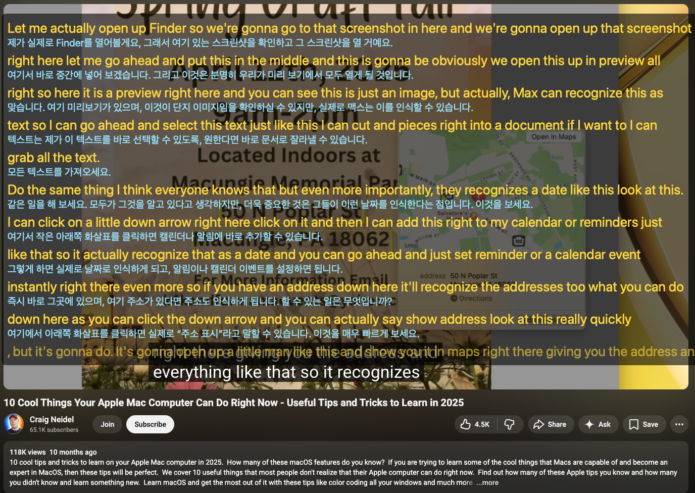
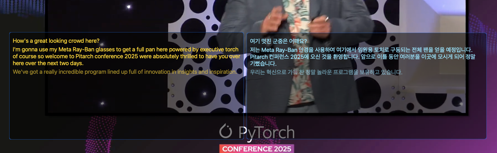
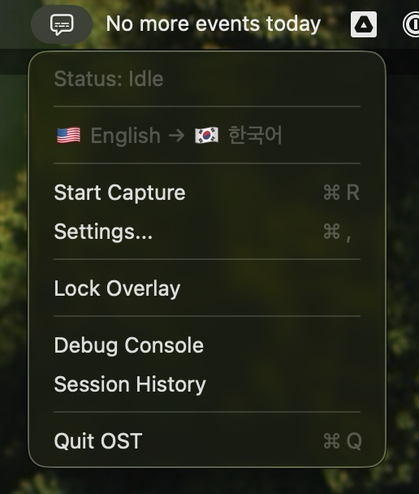
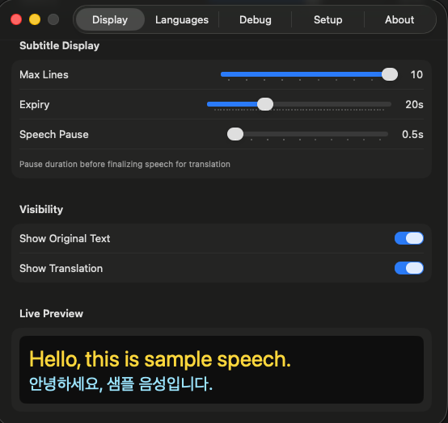
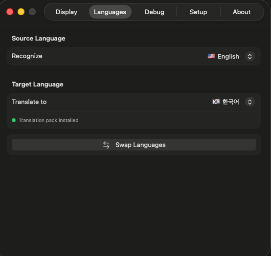
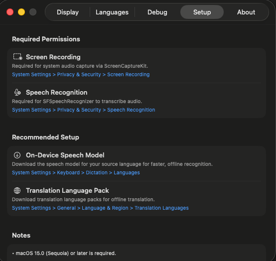
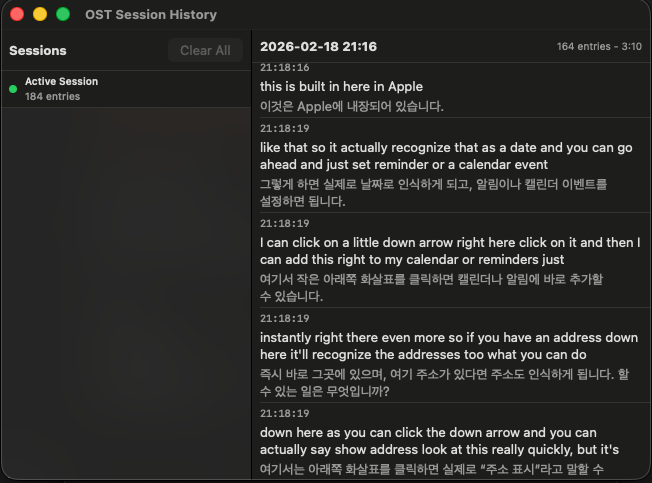

[🇬🇧 English](README.md) | [🇰🇷 한국어](README.ko.md) | [🇨🇳 中文](README.zh.md) | 🇯🇵 **日本語**

# OST — On-Screen Translator

macOS向けのリアルタイム音声認識・翻訳オーバーレイアプリです。

システムオーディオをキャプチャし、AppleのSpeechフレームワークを使用して音声をテキストに変換し、翻訳された字幕をフローティングオーバーレイウィンドウに表示します。YouTube、ポッドキャスト、Zoom/Teamsミーティングなど、あらゆるオーディオソースで動作します。

## スクリーンショット





<details>
<summary>その他のスクリーンショット</summary>

| メニューバー | 設定 — ディスプレイ |
|:---:|:---:|
|  |  |

| 設定 — 言語 | 設定 — 初期設定 |
|:---:|:---:|
|  |  |

| セッション履歴 |
|:---:|
|  |

</details>

## 免責事項

このプロジェクトはAI支援開発によって作成・保守されています。コード、ビルドスクリプト、ドキュメント、CI/CD設定は、本番利用前に慎重にレビューおよびテストしてください。

## 機能

- **リアルタイムシステムオーディオキャプチャ** — ScreenCaptureKit（16kHzモノラルPCM）
- **音声認識** — SFSpeechRecognizer（オンデバイスまたはサーバーベース）
- **リアルタイム翻訳** — Apple Translationフレームワーク — 認識中にリアルタイムで翻訳（最終結果を待たない）
- **デュアルディスプレイモード**：
  - **統合** — 認識テキストと翻訳テキストを1つのオーバーレイに表示
  - **分割** — 認識ウィンドウと翻訳ウィンドウを分離し、個別に配置可能
- **フローティングオーバーレイ** — サイズ変更、移動可能、常に最前面表示、外観カスタマイズ
- **ロック/アンロック** — ロック = クリック透過、アンロック = 移動/サイズ変更/スクロール
- **スクロール可能な字幕履歴**（自動スクロール）
- **外観カスタマイズ** — 原文/翻訳テキスト別のフォントサイズ/色、背景色/透明度
- **自動言語検出**（英語、韓国語、日本語、中国語）
- **スマートテキスト処理** — 文ベースの分割、音声停止検出、重複フィルタリング、句読点整理
- **セッション履歴**の記録とエクスポート
- **メニューバーアプリ** — Dockアイコンなし、最小リソース使用

## システム要件

- macOS 15.0（Sequoia）以降
- Apple Silicon（arm64）

## インストール

### 方法A：ビルド済みバイナリをダウンロード（推奨）

1. [最新リリース](https://github.com/9bow/OST/releases/latest)から `OST.zip` をダウンロード
2. 解凍して `OST.app` をアプリケーションフォルダに移動
3. 初回実行時にmacOSがアプリをブロックする場合：
   ```bash
   xattr -dr com.apple.quarantine /Applications/OST.app
   ```

### 方法B：ソースからビルド

**Xcode Command Line Tools** が必要です：

```bash
xcode-select --install
```

詳細は下記の[ビルド](#ビルド)セクションを参照してください。

## セットアップガイド

### ステップ1：必要な権限の付与

初回起動時、macOSが以下の権限を要求する場合があります。要求されない場合は手動で有効にしてください：

| 権限 | 用途 | 有効化方法 |
|---|---|---|
| **画面収録** | ScreenCaptureKitによるシステムオーディオキャプチャ | システム設定 > プライバシーとセキュリティ > 画面とシステムオーディオ録音 > OSTを有効化 |
| **システムオーディオ録音** | macOS 15+のシステムオーディオキャプチャ権限 | システム設定 > プライバシーとセキュリティ > 画面とシステムオーディオ録音 > OSTを有効化 |
| **音声認識** | SFSpeechRecognizerへのアクセス | システム設定 > プライバシーとセキュリティ > 音声認識 > OSTを有効化 |

> システム設定で権限を手動で有効化した場合は、変更を反映するためにOSTを再起動してください。

### ステップ2：Siriと音声入力の有効化

音声認識（特にサーバーベース）にはSiriと音声入力が有効である必要があります：

1. **システム設定 > SiriとSpotlight** を開く
2. **Siri**（または「聞き取り...」）を有効化
3. オンデバイス認識のみ使用する場合、Siriを有効にする必要はありません — ただし音声モデルのダウンロードが必要です（ステップ3参照）

### ステップ3：オンデバイス音声モデルのダウンロード（推奨）

より高速で、オフラインでも動作し、より安定した認識のために：

1. **システム設定 > 一般 > キーボード > 音声入力** を開く
2. **言語** からソース言語の音声モデルをダウンロード（例：英語、韓国語、日本語）
3. ダウンロード後、OST設定 > 言語タブで **「オンデバイス認識」** が有効になっていることを確認

> オンデバイスモデルがない場合、サーバーベースの認識が使用されます。インターネット接続が必要で、遅延が大きくなる場合があります。

### ステップ4：翻訳言語パックのダウンロード（推奨）

Apple Translationフレームワークによるオフライン翻訳のために：

1. **システム設定 > 一般 > 言語と地域 > 翻訳言語** を開く
2. 必要な言語ペアをダウンロード（例：英語 ↔ 日本語）

> 翻訳言語パックがないと、オフライン翻訳は機能しません。

## ビルド

```bash
# Clone the repository
git clone https://github.com/9bow/OST.git
cd OST

# Full build → produces build/OST.app
./build.sh

# Type-check only (no binary)
./build.sh --typecheck

# Run project checks
./test.sh

# Clean build
./build.sh --clean

# Run
open build/OST.app
```

Xcodeプロジェクトは不要です。ビルドスクリプトが `xcrun swiftc` を通じて全てのSwiftソースをコンパイルします。
`./test.sh` はシステムのコマンドラインツールのみを使用し、ドキュメント、ワークフロー、リグレッション、動作、タイプチェックのゲートを実行します。
実際のmacOS権限、音声キャプチャ、Apple Translation言語パック、またはオンライン代替翻訳のネットワーク動作が必要なリリース確認には、[docs/manual-qa.md](docs/manual-qa.md) を使用してください。

> 初回実行時にmacOSがアプリをブロックする場合、以下を実行してください：
> ```bash
> xattr -dr com.apple.quarantine build/OST.app
> ```

## 使い方

### セッションの開始

1. メニューバーの **字幕アイコン** をクリック
2. ソース言語とターゲット言語を選択（自動検出には「Auto」を使用）
3. **Start Capture** をクリックしてシステムオーディオのキャプチャを開始
4. リアルタイム音声認識と翻訳を表示するオーバーレイウィンドウが表示される

### オーバーレイの操作

| 操作 | 方法 |
|---|---|
| **ロック/アンロック** | メニューバー > Lock Overlay、または 設定 > ディスプレイ > オーバーレイウィンドウ |
| **移動** | アンロック後、オーバーレイウィンドウをドラッグ |
| **サイズ変更** | アンロック後、ウィンドウの端をドラッグ |
| **スクロール** | アンロック後、字幕履歴をスクロール |
| **位置リセット** | 設定 > ディスプレイ > "Reset All Overlay Windows" |

- **ロックモード**：オーバーレイがクリックを透過します — 背後のウィンドウと通常通り操作可能
- **アンロックモード**：ドラッグで移動、端をドラッグでサイズ変更、字幕履歴のスクロール。最新テキストへ自動スクロール

### ディスプレイモード

**設定 > ディスプレイ > モード** で設定：

- **統合**：原文と翻訳テキストを1つのウィンドウに表示
- **分割**：デフォルトモードで、認識（原文）と翻訳を2つの別々のウィンドウに分離。各ウィンドウを独立して配置・サイズ変更可能。メニューバーのロック/アンロックは両方のウィンドウに同時に適用され、設定では各ウィンドウを個別にロック可能

### ヒント

- **音声停止**：設定 > ディスプレイ > "Speech Pause" スライダーで調整（デフォルト3秒）。短い値はテキストをより早く確定し、長い値は自然な文末を待つ
- **字幕の有効期限**：古い字幕は設定された時間後に自動的に消える（デフォルト20秒）
- **最大行数**：同時に表示される字幕エントリの数を制御（デフォルト3）
- **セッション履歴**：デフォルトで有効です。メニューバー > Session Historyで過去の音声認識セッションを確認・エクスポートでき、設定 > デバッグで保存を無効化できます
- **オンデバイス認識**：デフォルトで有効です。選択した言語モデルが利用できない場合、またはサーバーベース認識を使いたい場合は、設定 > 言語で無効化してください
- **オンライン代替翻訳**：デフォルトでは無効です。Apple Translationが利用できない場合にOSTがテキストをGoogle Translateへ送信してよい場合のみ、設定 > 言語で有効にしてください

## アーキテクチャ

```
ScreenCaptureKit (16kHz mono) → SpeechRecognizer → AppState → TranslationService → Overlay Views
     SystemAudioCapture              SFSpeech          entries      Translation.framework     NSPanel
```

### ソース構造

```
OST/Sources/
├── App/             AppState, OSTApp, WindowManager, Logger, SessionRecorder
├── Audio/           SystemAudioCapture (ScreenCaptureKit)
├── Speech/          SpeechRecognizer, SupportedLanguages
├── Translation/     TranslationService, TranslationConfig
├── Settings/        UserSettings
├── UI/              SubtitleView, RecognitionOverlayView, TranslationOverlayView,
│                    OverlayWindow, MenuBarView, SettingsView, FontSettingsView, etc.
└── Accessibility/   AccessibilityManager
```

## トラブルシューティング

| 問題 | 解決方法 |
|---|---|
| オーディオがキャプチャされない | 画面収録とシステムオーディオ録音の権限を許可してください。システム設定で変更した場合はOSTを再起動してください |
| 音声認識が動作しない | 音声認識権限を付与；Siriと音声入力が有効か確認 |
| 翻訳が表示されない | 翻訳言語パックをダウンロードするか、Google Translateへテキストを送信してよい場合は設定 > 言語でオンライン代替翻訳を有効化 |
| オーバーレイが見えないがクリックをブロック | 設定 > ディスプレイ > "Reset All Overlay Windows" でデフォルト位置に復元 |
| macOSがアプリをブロック | インストール済みアプリは `xattr -dr com.apple.quarantine /Applications/OST.app`、ローカルビルドは `xattr -dr com.apple.quarantine build/OST.app` を実行 |
| オンデバイス認識で結果が出ない | システム設定 > キーボード > 音声入力で該当言語の音声モデルをダウンロード |

## 既知の問題

- **エンドポイント検出（EPD）** — 音声分割は適切なエンドポイント検出ではなく、ポーズタイマーと文境界検出を使用しています。字幕の境界が文の途中で分割されたり、無関係なフレーズが結合されたりする場合があります。
- **自動言語検出** — 自動検出は最初の約15文字に対してNLLanguageRecognizerを使用するため、短いまたは曖昧な入力から言語を誤認識する可能性があります。検出はセッションごとに1回のみ実行されます。
- **翻訳の一貫性** — 翻訳は音声セグメントごとにトリガーされます。短いまたは断片的なセグメントは、一貫性の低い翻訳を生成する可能性があります。
- **音声認識の再起動間隔** — SFSpeechRecognizerの認識タスクは約60秒後に期限切れとなり、自動的に再起動します。重複検出によりテキストの重複を最小限に抑えますが、認識に短い空白が生じる場合があります。

## ライセンス

[MIT](LICENSE)
