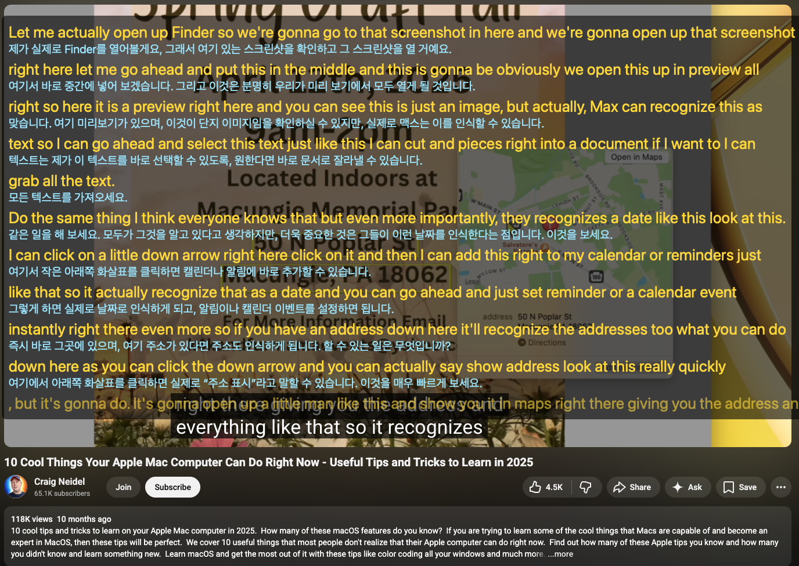
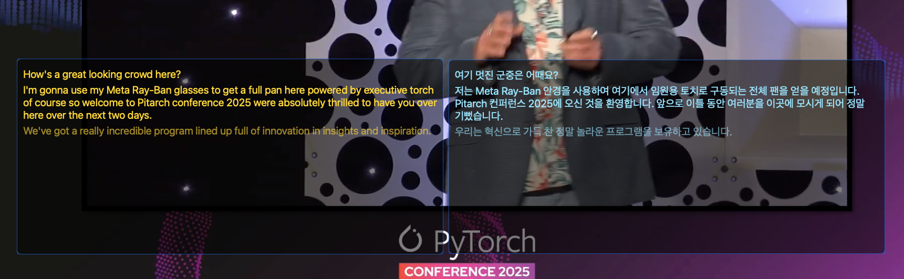
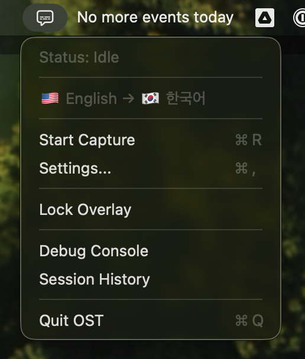
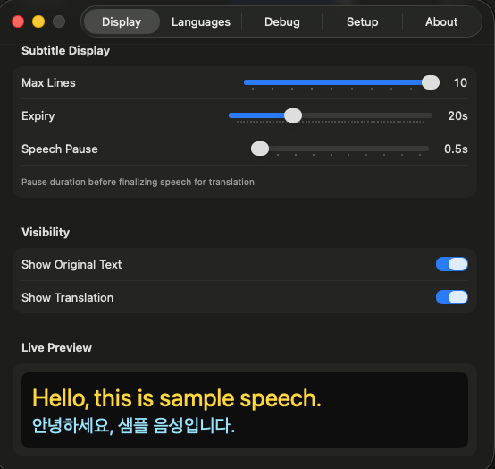
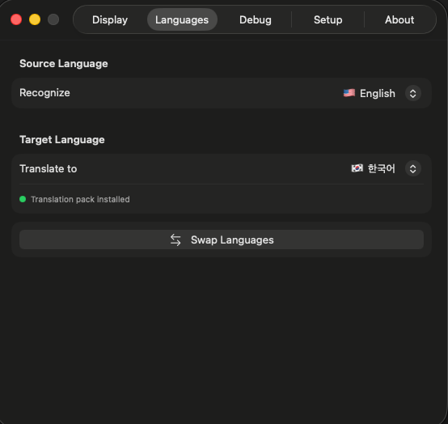
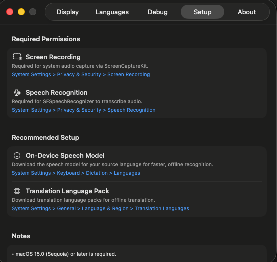
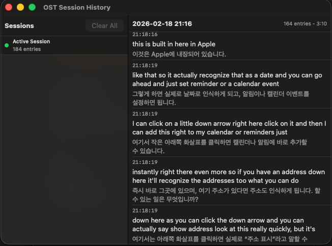

🇬🇧 English | [🇰🇷 한국어](README.ko.md) | [🇨🇳 中文](README.zh.md) | [🇯🇵 日本語](README.ja.md)

# OST — On-Screen Translator

Real-time speech recognition and translation overlay for macOS.

Captures system audio, transcribes speech using Apple's Speech framework, and displays translated subtitles in a floating overlay window. Works with any audio source — YouTube, podcasts, Zoom/Teams meetings, and more.

## Screenshots





<details>
<summary>More screenshots</summary>

| Menu Bar | Settings — Display |
|:---:|:---:|
|  |  |

| Settings — Languages | Settings — Setup |
|:---:|:---:|
|  |  |

| Session History |
|:---:|
|  |

</details>

## Disclaimer

This project was entirely written by [Claude](https://claude.ai/) (Anthropic's AI assistant). The code, build scripts, documentation, and CI/CD configuration were all generated through AI-assisted development. While functional, the code has not undergone formal human code review — use at your own discretion.

## Features

- **Real-time system audio capture** via ScreenCaptureKit (16kHz mono PCM)
- **Speech-to-text** using SFSpeechRecognizer (on-device or server-based)
- **Live translation** via Apple Translation framework — translates text as it's being recognized, not just after finalization
- **Dual display modes**:
  - **Combined** — single overlay with both recognized and translated text
  - **Split** — separate recognition and translation windows, independently positionable
- **Floating overlay** — resizable, movable, always-on-top window with customizable appearance
- **Lock/Unlock** — locked = click-through, unlocked = move/resize/scroll
- **Scrollable subtitle history** with auto-scroll
- **Customizable appearance** — separate font size/color for original and translated text, background color/opacity
- **Automatic language detection** (English, Korean, Japanese, Chinese)
- **Smart text processing** — sentence-based segmentation, pause detection, duplicate filtering, punctuation cleanup
- **Session history** recording with export
- **Menu bar app** — no Dock icon, minimal footprint

## Requirements

- macOS 15.0 (Sequoia) or later
- Apple Silicon (arm64)

## Installation

### Option A: Download Pre-built Binary (Recommended)

1. Download `OST.zip` from the [latest release](https://github.com/9bow/OST.git/releases/latest)
2. Unzip and move `OST.app` to your Applications folder
3. If macOS blocks the app on first run:
   ```bash
   xattr -dr com.apple.quarantine /Applications/OST.app
   ```

### Option B: Build from Source

Requires **Xcode Command Line Tools**:

```bash
xcode-select --install
```

See the [Build](#build) section below for full instructions.

## Setup Guide

### Step 1: Grant Required Permissions

On first launch, macOS will prompt for the following permissions. If not prompted, enable them manually:

| Permission | Purpose | How to Enable |
|---|---|---|
| **Screen Recording** | System audio capture via ScreenCaptureKit | System Settings > Privacy & Security > Screen Recording > Enable OST |
| **Speech Recognition** | SFSpeechRecognizer access | System Settings > Privacy & Security > Speech Recognition > Enable OST |

> After granting permissions, you may need to restart OST for changes to take effect.

### Step 2: Enable Siri & Dictation

Speech recognition (especially server-based) requires Siri & Dictation to be enabled:

1. Open **System Settings > Siri & Spotlight**
2. Turn on **Siri** (or "Listen for...")
3. If using on-device recognition only, Siri does not need to be active — but the speech model must be downloaded (see Step 3)

### Step 3: Download On-Device Speech Model (Recommended)

For faster, offline, and more reliable recognition:

1. Open **System Settings > General > Keyboard > Dictation**
2. Under **Languages**, download the speech model for your source language (e.g., English, Korean, Japanese)
3. After download, enable **"On-device recognition"** in OST Settings > Languages tab

> Without the on-device model, server-based recognition is used. This requires internet and may have higher latency.

### Step 4: Download Translation Language Pack (Recommended)

For offline translation using Apple Translation framework:

1. Open **System Settings > General > Language & Region > Translation Languages**
2. Download the language pair you need (e.g., English ↔ Korean)

> Without the translation pack, translation will not work offline.

## Build

```bash
# Clone the repository
git clone https://github.com/9bow/OST.git
cd OST

# Full build → produces build/OST.app
./build.sh

# Type-check only (no binary)
./build.sh --typecheck

# Clean build
./build.sh --clean

# Run
open build/OST.app
```

No Xcode project is required. The build script compiles all Swift sources via `xcrun swiftc`.

> If macOS blocks the app on first run, execute:
> ```bash
> xattr -dr com.apple.quarantine build/OST.app
> ```

## Usage

### Starting a Session

1. Click the **captions bubble icon** in the menu bar
2. Select source and target languages (or use "Auto" for automatic detection)
3. Click **Start** to begin capturing system audio
4. The overlay window(s) will appear with live transcription and translation

### Overlay Controls

| Action | How |
|---|---|
| **Lock/Unlock** | Menu bar > Lock Overlay, or Settings > Display > Overlay Window |
| **Move** | Unlock, then drag the overlay window |
| **Resize** | Unlock, then drag the window edges |
| **Scroll** | Unlock, then scroll through subtitle history |
| **Reset position** | Settings > Display > "Reset All Overlay Windows" |

- **Locked mode**: The overlay is click-through — interact with windows behind it normally
- **Unlocked mode**: Drag to move, resize edges, scroll through subtitle history. Auto-scrolls to the latest text

### Display Modes

Configure in **Settings > Display > Mode**:

- **Combined**: Single window showing both original and translated text
- **Split**: Two separate windows — recognition (original text) and translation. Each window can be independently positioned and resized. Lock/Unlock applies to both windows simultaneously

### Tips

- **Speech Pause**: Adjust in Settings > Display > "Speech Pause" slider. Shorter values finalize text faster; longer values wait for natural sentence endings
- **Subtitle Expiry**: Old subtitles automatically fade after the configured time (default 10s)
- **Max Lines**: Control how many subtitle entries are visible at once
- **Session History**: View past transcription sessions via menu bar > Session History. Sessions can be exported for reference

## Architecture

```
ScreenCaptureKit (16kHz mono) → SpeechRecognizer → AppState → TranslationService → Overlay Views
     SystemAudioCapture              SFSpeech          entries      Translation.framework     NSPanel
```

### Source Layout

```
OST/Sources/
├── App/             AppState, OSTApp, WindowManager, Logger, SessionRecorder
├── Audio/           SystemAudioCapture (ScreenCaptureKit)
├── Speech/          SpeechRecognizer, SupportedLanguages
├── Translation/     TranslationService, TranslationConfig
├── Settings/        UserSettings
├── UI/              SubtitleView, RecognitionOverlayView, TranslationOverlayView,
│                    OverlayWindow, MenuBarView, SettingsView, FontSettingsView, etc.
└── Accessibility/   AccessibilityManager
```

## Troubleshooting

| Problem | Solution |
|---|---|
| No audio captured | Grant Screen Recording permission in System Settings, then restart OST |
| Speech recognition not working | Grant Speech Recognition permission; ensure Siri & Dictation is enabled |
| Translation not appearing | Download translation language pack in System Settings > Translation Languages |
| Overlay invisible but blocking clicks | Use Settings > Display > "Reset All Overlay Windows" to restore default position |
| macOS blocks the app | Run `xattr -dr com.apple.quarantine build/OST.app` |
| On-device recognition produces no results | Download the speech model for your language in System Settings > Keyboard > Dictation |

## Known Issues

- **Endpoint detection (EPD)** — Speech segmentation uses a pause timer combined with sentence boundary detection, not proper endpoint detection. Subtitle boundaries may sometimes split mid-sentence or merge unrelated phrases.
- **Automatic language detection** — Auto-detect uses NLLanguageRecognizer on the first ~15 characters, which may misidentify the language from short or ambiguous input. Detection only runs once per session.
- **Translation consistency** — Translation is triggered per speech segment. Short or fragmented segments may produce less coherent translations.
- **Speech recognition restart gap** — SFSpeechRecognizer's recognition task expires after ~60 seconds and auto-restarts. Overlap detection minimizes duplicate text, but a brief gap in recognition may still occur.

## License

[MIT](LICENSE)
